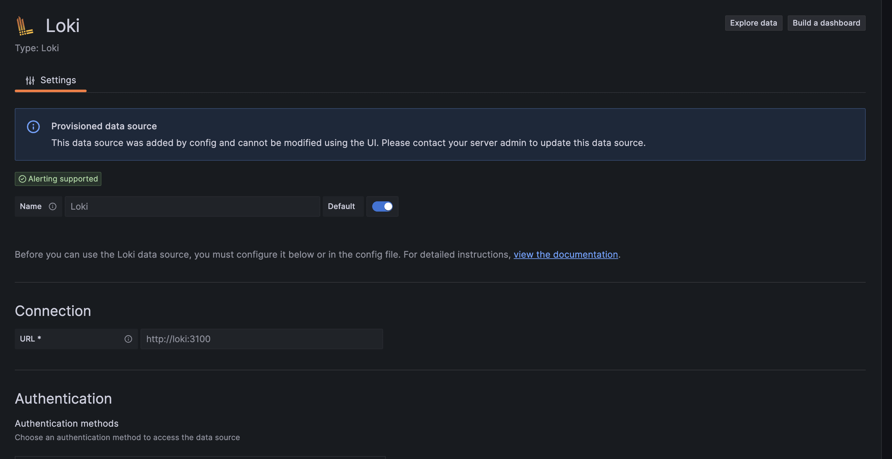
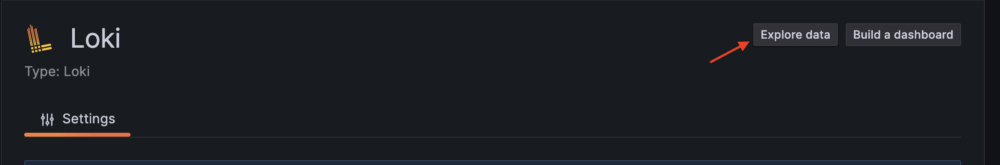
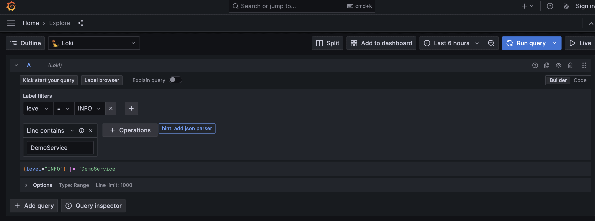
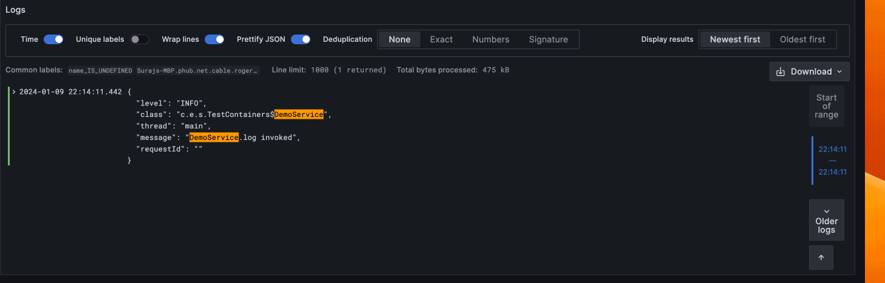

Logging in Spring Boot With Loki
================================
*Source: https://www.baeldung.com/spring-boot-loki-grafana-logging*

*Last updated: March 31, 2024*

*Written by: [Suraj Mishra](https://www.baeldung.com/author/surajmishra "Posts by Suraj Mishra")*

*Reviewed by: [Liam Williams](https://www.baeldung.com/editor/liamwilliams "Reviewed by Liam Williams")*


1\. Introduction
----------------

Grafana Labs developed [Loki](/ops/grafana-loki), an open-source log aggregation system inspired by [Prometheus](https://prometheus.io/). Its purpose is to store and index log data, facilitating efficient querying and analysis of logs generated by diverse applications and systems.

In this article, we’ll set up logging with Grafana Loki for a Spring Boot application. Loki will collect and aggregate the application logs, and Grafana will display them.

2\. Running Loki and Grafana Services
-------------------------------------

We’ll first spin up Loki and Grafana services so that we can collect and observe logs. [Docker](/spring-boot-docker-start-with-profile) containers will help us to more easily configure and run them.

First, let’s compose Loki and Grafana services in a [docker-compose](/spring-boot-postgresql-docker) file:

```yml
    version: "3"
    networks:
      loki:
    services:
      loki:
        image: grafana/loki:2.9.0
        ports:
          - "3100:3100"
        command: -config.file=/etc/loki/local-config.yaml
        networks:
          - loki
      grafana:
        environment:
          - GF_PATHS_PROVISIONING=/etc/grafana/provisioning
          - GF_AUTH_ANONYMOUS_ENABLED=true
          - GF_AUTH_ANONYMOUS_ORG_ROLE=Admin
        entrypoint:
          - sh
          - -euc
          - |
            mkdir -p /etc/grafana/provisioning/datasources
            cat <<EOF > /etc/grafana/provisioning/datasources/ds.yaml
            apiVersion: 1
            datasources:
            - name: Loki
              type: loki
              access: proxy
              orgId: 1
              url: http://loki:3100
              basicAuth: false
              isDefault: true
              version: 1
              editable: false
            EOF
            /run.sh
        image: grafana/grafana:latest
        ports:
          - "3000:3000"
        networks:
          - loki

```
Next, we need to bring up the services using the _docker-compose_ command:

freestar.config.enabled\_slots.push({ placementName: "baeldung\_leaderboard\_mid\_1", slotId: "baeldung\_leaderboard\_mid\_1" });

    docker-compose up

Finally, let’s confirm if both services are up:

    docker ps
    
    211c526ea384        grafana/loki:2.9.0       "/usr/bin/loki -conf…"   4 days ago          Up 56 seconds       0.0.0.0:3100->3100/tcp   surajmishra_loki_1
    a1b3b4a4995f        grafana/grafana:latest   "sh -euc 'mkdir -p /…"   4 days ago          Up 56 seconds       0.0.0.0:3000->3000/tcp   surajmishra_grafana_1

3\. Configuring Loki With Spring Boot
-------------------------------------

Once we’ve spun up Grafana and the Loki service, we need to configure our application to send logs to it. **We’ll use [_loki-logback-appender_](https://mvnrepository.com/artifact/com.github.loki4j/loki-logback-appender), which will be responsible for sending logs to the Loki aggregator to store and index logs.**

First, we need to add _loki-logback-appender_ in the _pom.xml_ file:

    <dependency>
        <groupId>com.github.loki4j</groupId>
        <artifactId>loki-logback-appender</artifactId>
        <version>1.4.1</version>
    </dependency>

Second, we need to create a _logback-spring.xml_ file under the _src/main/resources_ folder. This file will control the logging behavior, such as the format of logs, the endpoint of our Loki service, and others, for our Spring Boot application:

    <?xml version="1.0" encoding="UTF-8"?>
    <configuration>        
       <appender name="LOKI" class="com.github.loki4j.logback.Loki4jAppender">
            <http>
                <url>http://localhost:3100/loki/api/v1/push</url>
            </http>
            <format>
                <label>
                    <pattern>app=${name},host=${HOSTNAME},level=%level</pattern>
                    <readMarkers>true</readMarkers>
                </label>
                <message>
                    <pattern>
                        {
                        "level":"%level",
                        "class":"%logger{36}",
                        "thread":"%thread",
                        "message": "%message",
                        "requestId": "%X{X-Request-ID}"
                        }
                    </pattern>
                </message>
             </format>
         </appender>
         
         <root level="INFO">
            <appender-ref ref="LOKI" />
         </root>
    </configuration>

Once we finish setting up, let’s write a simple service that logs data at INFO level:

    @Service
    class DemoService{
    
        private final Logger LOG = LoggerFactory.getLogger(DemoService.class);
    
        public void log(){
            LOG.info("DemoService.log invoked");
        }
    }

4\. Test Verification
---------------------

Let’s conduct a live test by spinning up Grafana and Loki containers, and then executing the service method to push the logs to Loki. Afterward, we’ll query Loki using the [HTTP API](https://grafana.com/docs/loki/latest/reference/api/#query-loki-over-a-range-of-time) to confirm if the log was indeed pushed. For spinning up Grafana and Loki containers, please see the earlier section.

First, let’s execute the _DemoService.log()_ method, which will call _Logger.info()_. This sends a message using the _loki-logback-appender_, which Loki will collect:

    DemoService service = new DemoService();
    service.log();

Second, we’ll create a request for invoking the REST endpoint provided by the Loki HTTP API. This GET API accepts query parameters representing the _query_, _start_ time, and _end_ time. We’ll add those parameters as part of our request object:

    HttpHeaders headers = new HttpHeaders();
    headers.setContentType(MediaType.APPLICATION_JSON);
    
    String query = "{level=\"INFO\"} |= `DemoService.log invoked`";
    
    // Get time in UTC
    LocalDateTime currentDateTime = LocalDateTime.now(ZoneOffset.UTC);
    String current_time_utc = currentDateTime.format(DateTimeFormatter.ofPattern("yyyy-MM-dd'T'HH:mm:ss'Z'"));
    
    LocalDateTime tenMinsAgo = currentDateTime.minusMinutes(10);
    String start_time_utc = tenMinsAgo.format(DateTimeFormatter.ofPattern("yyyy-MM-dd'T'HH:mm:ss'Z'"));
    
    URI uri = UriComponentsBuilder.fromUriString(baseUrl)
      .queryParam("query", query)
      .queryParam("start", start_time_utc)
      .queryParam("end", current_time_utc)
      .build()
      .toUri();

Next, let’s use the request object to execute REST request:

    RestTemplate restTemplate = new RestTemplate();
    ResponseEntity<String> response = restTemplate.exchange(uri, HttpMethod.GET, new HttpEntity<>(headers), String.class);

Now we need to process the response and extract the log messages we’re interested in. We’ll use an _[ObjectMapper](/jackson-object-mapper-tutorial)_ to read the JSON response and extract the log messages:


    ObjectMapper objectMapper = new ObjectMapper();
    List<String> messages = new ArrayList<>();
    String responseBody = response.getBody();
    JsonNode jsonNode = objectMapper.readTree(responseBody);
    JsonNode result = jsonNode.get("data")
      .get("result")
      .get(0)
      .get("values");
    
    result.iterator()
      .forEachRemaining(e -> {
          Iterator<JsonNode> elements = e.elements();
          elements.forEachRemaining(f -> messages.add(f.toString()));
      });
    

Finally, let’s assert that the messages we receive in the response contain the message that was logged by the _DemoService_:

    assertThat(messages).anyMatch(e -> e.contains(expected));

5\. Log Aggregation and Visualization
-------------------------------------

Our service logs are pushed to the Loki service because of the configuration setup with the _loki-logback-appender_. We can visualize it by visiting _http://localhost:3000_ (where the Grafana service is deployed) in our browser.

**To see logs that have been stored and indexed in Loki, we need to use Grafana. The Grafana datasource provides configurable connection parameters for Loki where we need to enter the Loki endpoint, authentication mechanism, and more.**

First, let’s configure the Loki endpoint to which logs have been pushed:



Once we’ve successfully configured the data source, let’s move to explore the data page for querying our logs:


We can write our [query](https://grafana.com/docs/loki/latest/query/) to fetch app logs into Grafana for visualization. In our demo service, we’re pushing _INFO_ logs, so we need to add that to our filter and run the query:



Once we run the query, we’ll see all the _INFO_ logs that match our search:



6\. Conclusion
--------------

In this article, we set up logging for a Spring Boot application with Grafana Loki. We also verified our setup with a unit test and visualization, using simple logic that logged _INFO_ logs and setting a Loki data source in Grafana.